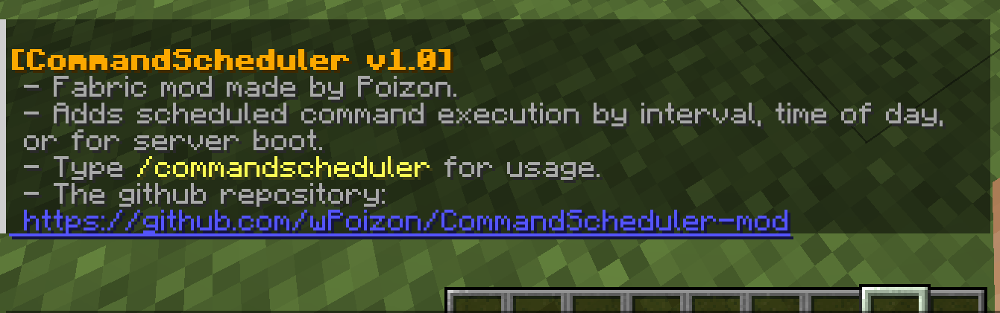
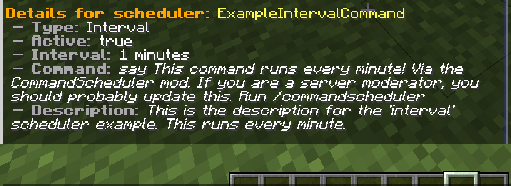

  

# Command Scheduler (Fabric)

A Minecraft Fabric mod for schedulable and repeatable commands — made for 1.20.2.  
Created by Poizon.

[this file](ToDoList.md)

## Status

The mod is **mostly complete and stable**.  
Almost all planned commands have been added, and most core functionality has been tested for all sub-versions of 1.20 and 1.21. You can activate, deactivate, rename, and schedule commands via in-game commands. See [this file](ToDoList.md) to see what is finished and what features are planned ahead.

---

## What it does

This simple mod lets any OP on a server schedule commands to run automatically.  
You can schedule:

- Repeating commands on an interval (e.g., every 10 seconds)
- Commands at specific times (e.g., at 00:00 every day)
- One-time commands that run at server startup

---

## About

This is my first ever Minecraft mod! I made it for my own server, and I rushed through some parts to get it functional quickly — but added some helpful tools, command structure, and clean formatting to make it feel smooth.

⚠️ **Note**: 99% of the code was written by ChatGPT, under my constant guidance and review. I do know Java quite well but wanted it done quickly. Think of it as AI-assisted but user-shaped.

---

## Platform

- Minecraft version: **1.20.2**  
- Fabric Loader: **0.16.10**  
- Fabric API: **0.91.6+1.20.2**

[Modrinth page](https://modrinth.com/mod/command-scheduler)

## Screenshots

The printout for when running the "/commandscheduler about" command:

The printout for when showing details about a scheduler, by running"/commandscheduler details [id]":
